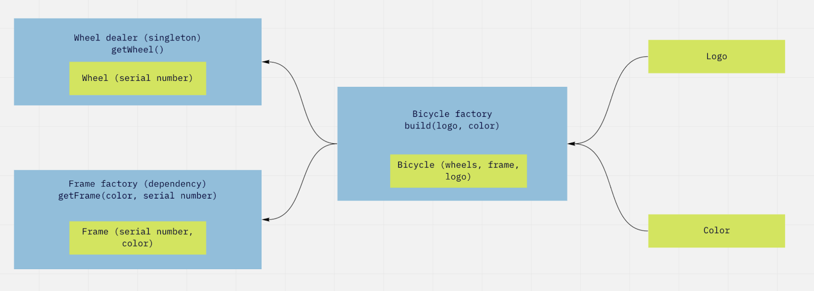

# BicycleFactory

Приложение должно реализовать инициализацию производственной цепочки велосипедов согласно представленной схеме.

## Глоссарий

<b>Колесо</b> — часть велосипеда, экземпляр класса, обладает уникальным серийным номером. Номер проставляется поставщиком колёс (дилером).

<b>Логотип</b> — строковый идентификатор компании.

<b>Цвет</b> — целочисленный RGB-идентификатор цвета велосипеда.

<b>Рама</b> — часть велосипеда, экземпляр класса, обладает уникальным серийным номером. Номер рамы и её цвет определяются с помощью заявки, в результате мы получаем уже пронумерованную и окрашенную раму.

<b>Велосипед</b> — экземпляр класса со следующими свойствами: логотип, рама, два колеса.

<b>Поставщик колёс</b> — синглтон, экземпляр класса. Созданием и существованием синглтона управляет менеджер зависимостей.

<b>Фабрика по производству рам</b> — зависимость. Создаётся фабрика в момент создания приложения, предоставляется менеджеру зависимостей в качестве аргумента при инициализации.

<b>Фабрика велосипедов</b> — экземпляр класса, который можно получить из менеджера зависимостей. У фабрики есть один метод — build, в который мы передаём логотип и цвет. Фабрика велосипедов обращается к поставщику колёс и фабрике рам для получения необходимых запчастей, из них она собирает велосипед и возвращает его из метода build.

## Технологии

- <b>Dagger</b>

- <b>Koin</b>
